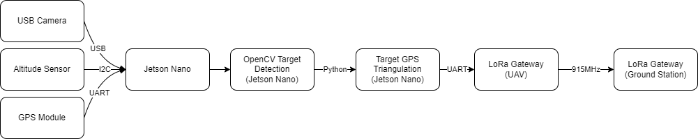

# 2022 ICAV Target Recognition

This system was built for the IMechE UAS Challenge, to find and return the GPS coordinate of a designated target in the flight path of an autonomous UAV. The system uses a USB webcam to take pictures at set intervals, and gets the current GPS location and altitude using external sensors. The picture is then run through a processing algorithm to determine the position of the target relative to the UAV, and thus calculate the GPS coordinate of the target. The target's GPS coordinate is then transmitted via LoRa to the ground station for scoring.

## Hardware Setup

In order to do image processing on-board the UAV, the Jetson Nano was chosen. More lightweight embedded systems like an Arduino or ESP32 would be unable to handle the image operations at a suitable resolution. A USB webcam was chosen as its long cable provided more flexibility with positioning the camera within the fuselage. A BME altitude sensor and NEO-M9N GPS module was used for positioning data, as they allow for a much higher refresh rate than cheaper GPS modules, as well as fast warm start capability.

| **Part**                       | **Purpose**       | **Link**                                |
|--------------------------------|-------------------|-----------------------------------------|
| Jetson Nano 4GB                | Compute           | https://www.sparkfun.com/products/16271 |
| Sparkfun NEO-M9N Breakout      | Positioning       | https://www.sparkfun.com/products/15712 |
| Sparkfun BME280 Breakout       | Positioning       | https://www.sparkfun.com/products/15440 |
| Buck Converter 5V/3A           | Power supply      | https://www.sparkfun.com/products/18375 |
| Generic USB Webcam             | Imaging           | https://www.sparkfun.com/products/16299 |
| LoRa Gateway 1 Channel (ESP32) | Data transmission | https://www.sparkfun.com/products/18074 |

## Software Architecture

The data pipeline is as follows, called at a regular interval:

Each component is designed to be modular; abstracting the interface from implementation so that different team members can work on the system without conflict.
